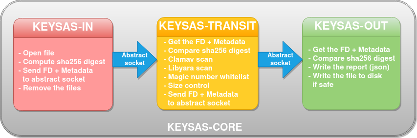

<div align="center">

</div>

# USB virus cleaning station

# 🚀 Main Features

- **File Retrieval**
  - From unsigned/untrusted USB keys (via **keysas-io**)
  - From remote network sources

- **Multi-layer File Scanning**
  - ClamAV antivirus integration
  - YARA rules parsing
  - File extension, type and size checks

- **Digital Signatures**
  - All scanned files and USB devices can be signed
  - Uses **hybrid post-quantum signature** (Ed25519 + ML-DSA-87)
  - Private keys stored in PKCS#8 format
  - Certificates issued and managed by **keysas-admin** internal PKI
  - Each verified file gets a **.krp** report

- **Authentication**
  - Support for user authentication using YubiKey 5 (via **keysas-fido**)

---

# 🔒 Security
  This project underwent a **professional security audit** conducted by [Amossys](https://www.amossys.fr/) an external company specialized in cybersecurity. 
  
  Since this audit, all security patches have been applied to the current v2.6. See SECURITY.md for more information.

---

# Keysas-core

## 🧱 Architecture Overview

<div align="center">

</div>


- Daemons communicate via **abstract sockets** and **raw file descriptors** (Linux only)
- Each daemon adds **metadata** and passes the file to the next
- The last daemon (`keysas-out`) determines if the file is accepted and writes it to the output directory (`sas_out`)
- A detailed **report** is generated for every file


## 🔒 Daemons Security Hardening

- Run as **unprivileged users**
- Isolated using:
  - **Systemd** security drop-in
  - **Landlock** sandbox
  - **Seccomp** filters (x86_64 & aarch64)

---

## 🧩 Project Components

| Name             | Description |
|------------------|-------------|
| **keysas-core**     | Core daemon pipeline for file scanning and report generation |
| **keysas-io**       | Monitors USB device insertions and verifies signatures (via `udev`) |
| **keysas-admin**    | Desktop GUI (Tauri) to manage devices, issue certificates and sign USB keys |
| **keysas-sign**     | CLI tool to import PEM certificates and manage signatures |
| **keysas-fido**     | CLI tool for managing YubiKey 5 user enrollment |
| **keysas-backend**  | WebSocket backend providing data to frontend |
| **keysas-frontend** | Read-only Vue.js interface for end-users |
| **keysas-firewall** | (WIP) Windows app to verify file origin from a Keysas station |

---

## Build && Installation


### 🐧 On Debian stable (Trixie):

```bash
sudo apt -qy install -y libyara-dev libyara10 wget cmake make lsb-release libseccomp-dev clamav-daemon clamav-freshclam pkg-config git bash libudev-dev libwebkit2gtk-4.1-dev build-essential curl wget libssl-dev libgtk-3-dev libayatana-appindicator3-dev librsvg2-dev acl xinit sudo 
sudo bash -c "$(wget -O - https://apt.llvm.org/llvm.sh)"
curl https://sh.rustup.rs -sSf | sh -s -- --default-toolchain nightly -y
source "$HOME/.cargo/env"
git clone --depth=1 https://github.com/keysas-fr/keysas && cd keysas
rustup default nightly
make help
make build
sudo make install
```

## User documentation & SBOMs

Latest versions of:

    User Documentation

    Software Bill of Materials (SBOMs)

...are auto-generated via GitHub Actions and available here: [https://keysas-fr.github.io/keysas/](https://keysas-fr.github.io/keysas/)

---
